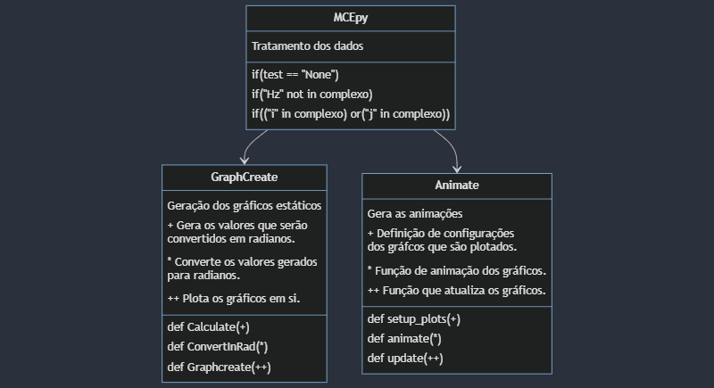

<div align="center">

# MCEpy

    

</div>

### Resultados dos testes

<div align="center">

| Tipo do teste | Resultado |
|---|---|
| Pytest | [](https://github.com/MauricioPaivadaSilva/MCEpy/actions/workflows/pytest.yaml) |

</div>

## Sobre a feature
A presente _feature_ apresenta-se em sua _versão 0.4.7_, sendo desenvolvida como parte do Programa Institucional de Bolsas de Iniciação Científica (PIBIC). Tem como foco interpretar dados inseridos como _strings_ (em formato de coordenadas ou frequência), gerando gráficos para representar visualmente os fenômenos elétricos em Corrente Alternada.

## Motivação

O este projeto tem como motivação o trabalho desenvolvido pelo LABin - Labratório de educação inclusiva.

## Sumário
* [Requisitos e forma de instalação](#requisitos-e-forma-de-instalação)
* [Funcionalidades esperadas](#funcionalidades-esperadas)
* [Resultados obtidos](#resultados-obtidos)
* [Formas de utilização](#formas-de-utilização)
* [Agradecimentos](#agradecimentos)

## Requisitos e forma de instalação

### Requisitos
<div align="center">

|Dependencia | Versão|
|---|---|
|Python | 3.12.0|
|pip | 23.3.2|
|Numpy | 1.26.3|
|Matplotlib | 3.8.2|
|Pytest | 8.0.0|

</div>

### Forma de Instalação

* Para instalar usando o setup.py: 

`pip install .`

* Para instalar usando o requirements.txt:

`pip install -r requirements.txt`

## Funcionalidades esperadas

- [x] Receber dados de valores puramente reais;
- [x] Receber dados de números complexos;
- [x] Gerar o gráfico de função senoidal;
- [x] Gerar o ciclo trigonométrico;
- [x] Gerar o vetor dentro do ciclo trigonométrico;
- [X] Apresentar mais de um gráfico em uma única tela;
- [x] Fazer a animação do ciclo trigonométrico;
- [x] Fazer a animação do gráfico da função senoidal.

### Fluxo de funcionamento das funcionalidades



## Resultados obtidos

Para a validação dos das funcionalidades implementadas na feature, são realizados testes em que é validadas as mensagens de erro, pois é importante saber exatamente o que está acontecemdo com no programa em caso de erro. Assim como é realizados testes que validam pixel a pixel da imagem dos gráficos gerados, garantindo a integridade da feature.

### Gráficos gerados

1. Gráfico de função senoidal


2. Ciclo Trigonométrico com vetor imaginário 2+2j


3. Ciclo Trigonométrico com vetor imaginário -2-2j


4. Ciclo Trigonométrico com vetor real 5


5. Ciclo Trigonométrico com vetor imaginário 10i


## Formas de utilização

* Execução independente:

```bash
python3 __init__.py 30Hz None
```

* Chmada da feature:

```Python
from MCEpy import MCEpy as mc
```

### Exemplo de uso

```Python
from MCEpy import MCEpy as mc

mc("10Hz", "None")
```

Lembrando que **todos** os dados devem ser inseridos como _str_. Assim como o parametro `None` **deve** ser mantido como segundo argumento, caso seja alterado, a lib irá trabalhar em modo de teste, gerando dados e salvando os mesmos.

Pode ser atribuido como valor imaginário tanto _i_ como _j_. E no caso dos gráficos animados, é necessário inserir _Hz_ após o valor, como no exemplo.

<div align="center">

|Exemplos de comandos que podem ser utilizados | Resumo da funcionalidade|
|---|---|
| `mc("x", "None")` | Irá gerar um gráfico senoidal estático. |
| `mc("y", "None")` | Irá gerar um gráfico senoidal estático. |
| `mc("5", "None")` | Irá gerar um gráfico do ciclo trigonométrico estático, com vetor puramente real. |
| `mc("10i", "None")` | Irá gerar um gráfico do ciclo trigonométrico estático, com vetor puramente imaginário. |
| `mc("2+3i", "None")` | Irá gerar um gráfico do ciclo trigonométrico estático em que há o vetor qe indica a representação gráfica do número complexo. No caso, o vetor direcionará para o primeio quadrante.|
| `mc("-2-3i", "None")`| Irá gerar um gráfico do ciclo trigonométrico estático em que há o vetor qe indica a representação gráfica do número complexo. No caso, o vetor direcionará para o terceiro quadrante. |
| `mc("60Hz", "None")`| Ira gerar os gráficos animados que se adaptarão confome a frequência inserida. |

</div>

## Agradecimentos

Agradecimentos em especial para a minha pedagoga e orientadora da iniciação científica M.ª Flávia Manuella de Almeida Ksiaszczyk por proporcionar a oportunidade de gerar tal trabalho. Agradeço também ao professor de Física Dr. Rudinei Celso de Souza Jantsch que nos auxiliou com interpretações físicas dos fenômenos elétricos de forma mais aprofundada.
