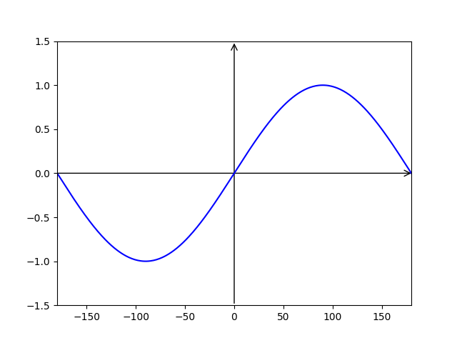
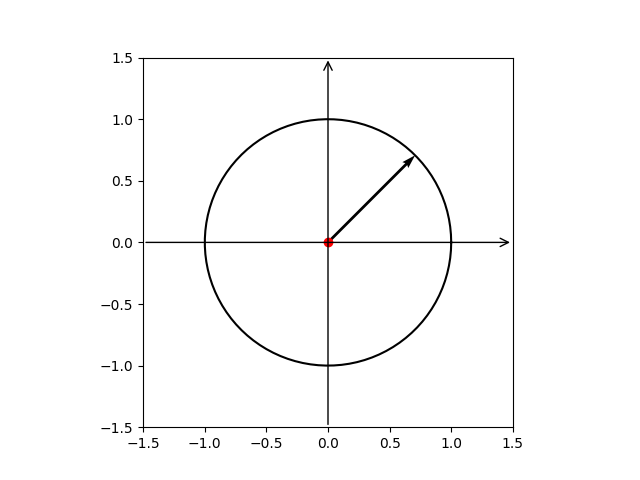
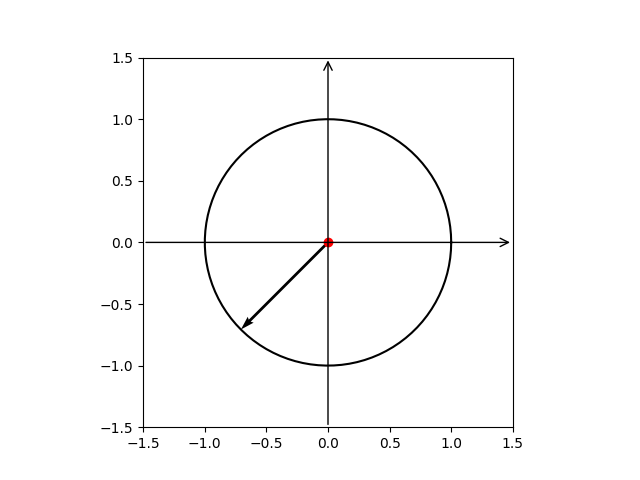
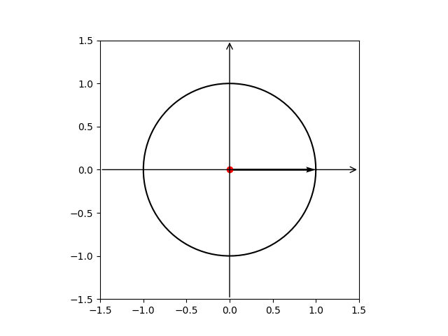
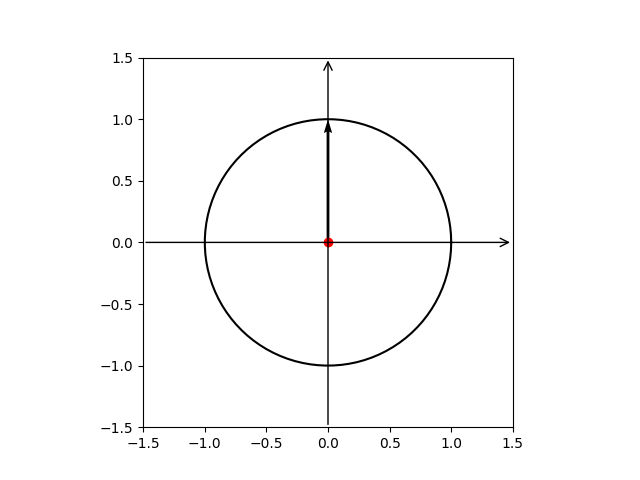

# MCEpy

    

### Resultados dos testes

*Há divergência nos resultados do teste com Pytest, pois em máquina real o resultado é de que passou em 100% dos testes, mas pelos testes do GitHub Actions ele falha. O resultado falho pode ser devido ao pytest analizar imagens que são geradas, ou por algum erro ao configurar os testes pelo GitHub Actions.*

| Tipo do teste | Resultado |
|---|---|
| Pytest |  |

## Sobre a biblioteca
A presente biblioteca aprensenta-se em sua *versão 0.3.0* e tem como foco interpretar dados inseridos em formato de coordenadas e de strings, e desta forma gera os gráficos para representar os dados inseridos.

## Motivação

O presente projeto tem como motivação o trabalho desenvolvido pelo LABin - Labratório de educação inclusiva, que tem como intuito o a pesquisa-ação na área do ensino inclusivo.

## Sumário
* [Requisitos e forma de instalação](#requisitos-e-forma-de-instalação)
* [Funcionalidades esperadas](#funcionalidades-esperadas)
* [Resultados obtidos](#resultados-obtidos)
* [Formas de utilização](#formas-de-utilização)
* [Agradecimentos](#agradecimentos)
## Requisitos e forma de instalação

### Requisitos

|Dependencia | Versão|
|---|---|
|Python | 3.12.0|
|pip | 23.3.2|
|Numpy | 1.26.3|
|Matplotlib | 3.8.2|
|Pytest | 8.0.0|

### Forma de Instalação

* Para instalar usando o setup.py: 

`pip install .`

* Para instalar usando o requirements.txt:

`pip install -r requirements.txt`

## Funcionalidades esperadas

- [x] Receber dados de valores puramente reais;
- [x] Receber dados de números complexos;
- [x] Gerar o gráfico de função senoidal;
- [x] Gerar o ciclo trigonométrico;
- [x] Gerar o vetor dentro do ciclo trigonométrico;
- [ ] Apresentar mais de um gráfico em uma única tela;
- [x] Fazer a animação do ciclo trigonométrico;
- [x] Fazer a animação do gráfico da função senoidal.

## Resultados obtidos

Para a validação dos das funcionalidades implementadas na lib, são realizados testes em que é validadas as mensagens de erro, pois é importante saber exatamente o que está acontecemdo com no programa em caso de erro. Assim como é realizados testes que validam pixel a pixel da imagem dos gráficos gerados, garantindo a integridade da lib.

### Gráficos gerados

* Gráfico de função senoidal

* Ciclo Trigonométrico com vetor imaginário 2+2j

* Ciclo Trigonométrico com vetor imaginário -2-2j

* Ciclo Trigonométrico com vetor real 5

* Ciclo Trigonométrico com vetor imaginário 10i

## Formas de utilização

* Chmada da lib:

`from MCEpy import Tratamento as tr`

|Comando | Dados a serem inseridos | Resumo da funcionalidade|
|---|---|---|
| `tr.Complex(, None)` | Exemplo de valore: `"2+3i"` ou `"-2-3j"`. Também pode ser inserido `"x"` ou `"y"`. Lembrando que todas os dados devem ser inseridos como _str_. | Direciona os dados para seu tratamento (**O parametro `None` deve ser mantido como segundo argumento, caso seja alterado, a lib irá trabalhar em modo de teste, gerando dados e salvando os mesmos**). Os dados podem ser interpretados como um vetor complexo, valor puramente real ou puramente imaginário. Ao inserir os dados como complexo ele retornará um **vetor**, já se for inserido _x_ ou _y_ retornará um gráfico **senoidal**.|

## Agradecimentos
.

.

.
